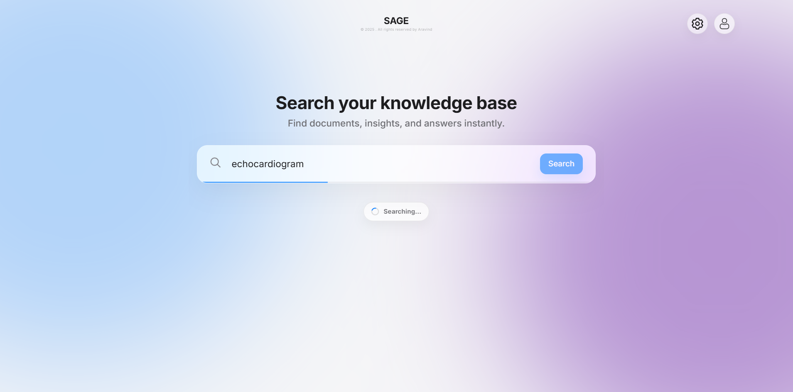
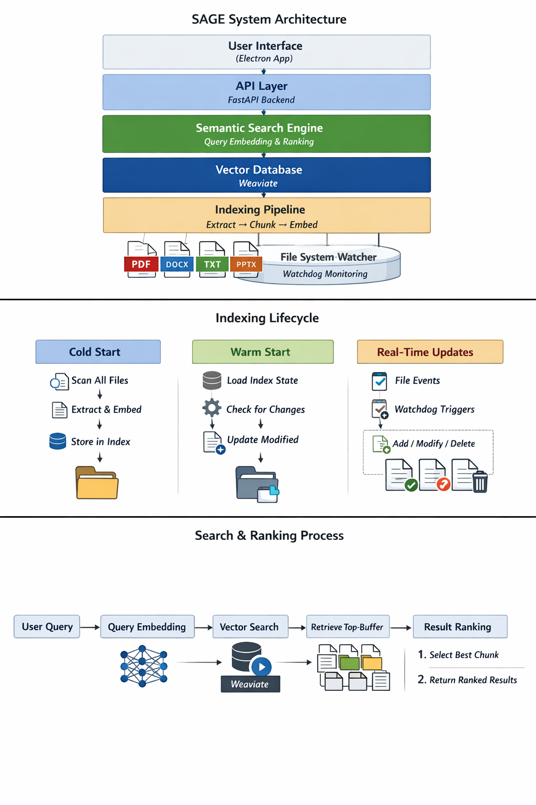
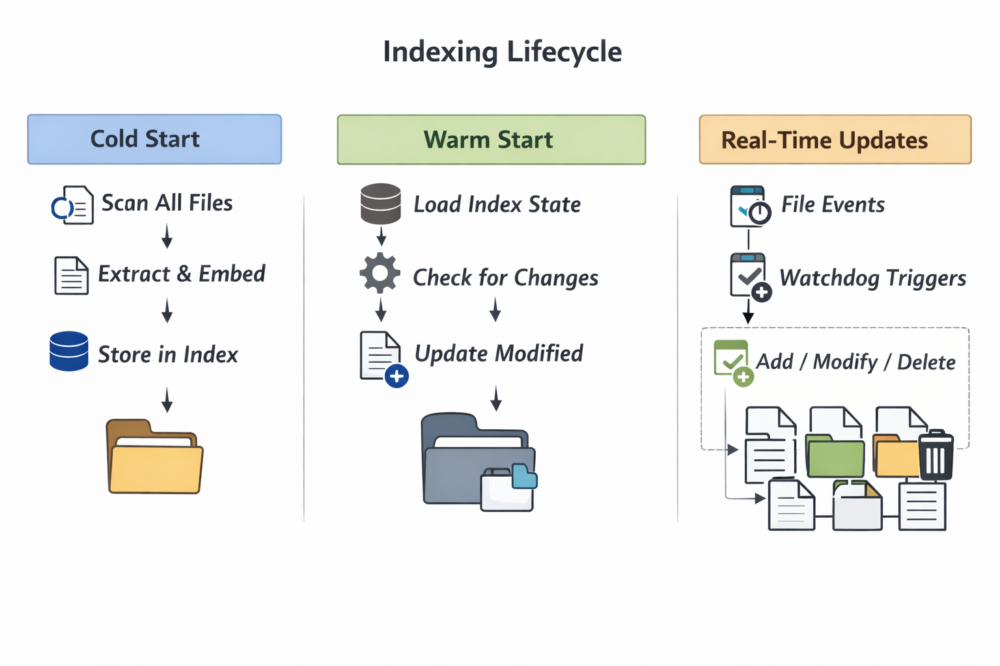
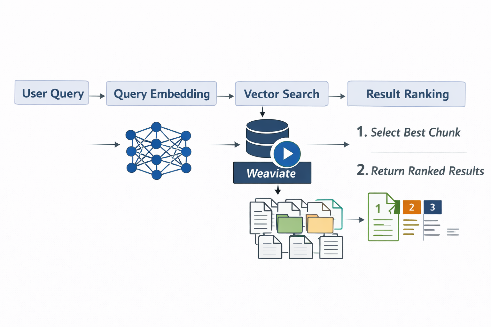

<p align="center">
  
</p>

<h1 align="center">SAGE</h1>
<h3 align="center">Semantic Analysis & Guided Exploration</h3>

<p align="center">
  <strong>SAGE is an offline semantic search tool that indexes local documents, generates embeddings, and retrieves relevant results using a Weaviate vector database and a desktop UI built with Electron</strong>
</p>

<p align="center">
  
  
  
  
</p>

<p align="center">
  
  
  
</p>

---

## 📖 Table of Contents

- [About](#-about)
- [Screenshots](#-screenshots)
- [Features](#-features)
- [Architecture](#-architecture)
  - [System Overview](#system-overview)
  - [Indexing Lifecycle](#-indexing-lifecycle)
  - [Search Ranking System](#-search-ranking-system)
- [Tech Stack](#-tech-stack)
- [Getting Started](#-getting-started)
- [Usage](#-usage)
- [API Reference](#-api-reference)
- [Configuration](#-configuration)
- [Troubleshooting](#-troubleshooting)
- [Roadmap](#-roadmap)
- [Contributing](#-contributing)
- [License](#-license)

---

## 🎯 About

**SAGE** (Semantic Analysis & Guided Exploration) is a **privacy-first, locally-hosted semantic search engine** designed to help you find documents based on meaning rather than exact keywords.

### The Problem

Traditional file search is frustrating:
- You need to remember exact filenames or keywords
- Searching "heart tests" won't find documents about "cardiac examinations"
- Important files get buried and forgotten

### The Solution

SAGE uses **AI-powered semantic understanding** to:
- Find documents by **meaning**, not just keywords
- Understand context and synonyms automatically
- Keep everything **100% local** — your data never leaves your machine

### Example Queries

| What You Search | What SAGE Finds |
|-----------------|-----------------|
| "heart health documents" | Cardiac care presentations, ECG reports, medical PDFs |
| "project deadline notes" | Meeting minutes, task lists, project timelines |
| "machine learning research" | Neural network papers, AI tutorials, ML notes |

---

## 📸 Screenshots

<p align="center">
  
  <br />
  <em>🔍 Semantic search in action — finding cardiac care documents from the query "echocardiogram"</em>
</p>

<p align="center">
  
  <br />
  <em>⚙️ Directory Management — configure up to 5 folders for SAGE to monitor and index</em>
</p>

<p align="center">
  
  <br />
  <em>✨ Modern glassmorphic UI with smooth animations and loading states</em>
</p>

---

## ✨ Features

### Core Capabilities

| Feature | Description |
|---------|-------------|
| 🧠 **Semantic Search** | AI-powered search that understands meaning, context, and synonyms |
| ⚡ **Hybrid Ranking** | Combines semantic similarity (80%) with keyword matching (20%) for optimal results |
| 🔒 **100% Local** | All processing happens on your machine — zero cloud dependencies |
| 📁 **Multi-Format Support** | Index TXT, PDF, DOCX, and PPTX files |
| 🔄 **Real-Time Monitoring** | Watchdog integration auto-indexes new and modified files |
| 🚀 **Incremental Indexing** | Smart caching skips unchanged files for fast re-indexing |
| 🖼️ **OCR Support** | Extract text from scanned PDFs using Tesseract OCR |
| 🎨 **Modern UI** | Beautiful glassmorphic Electron desktop application |
| ✏️ **Typo Tolerance** | Fuzzy spell correction using indexed vocabulary — misspelled queries still find results |
| ✈️ **Fully Offline** | HuggingFace offline mode ensures zero network requests after initial model download |

### Privacy & Security

- **Zero telemetry** — We don't collect any data
- **No cloud uploads** — Documents are processed entirely on your device
- **Open source** — Audit every line of code yourself
- **SQLite storage** — Lightweight local database for state management

---

## 🏗️ Architecture

### System Overview

<p align="center">
  
  <br />
  <em>📐 Complete system architecture showing the interaction between all SAGE components</em>
</p>

SAGE follows a **three-tier architecture** designed for complete offline operation while maintaining high performance and modularity:

#### **Presentation Layer (Electron + React)**
The desktop application is built with Electron, providing a native cross-platform experience. The React 18 frontend communicates exclusively via HTTP REST calls to the local backend, ensuring a clean separation of concerns. The UI features a modern glassmorphic design with smooth animations and responsive layouts.

#### **Application Layer (FastAPI Backend)**
The Python-based FastAPI server acts as the central orchestrator, handling:
- **REST API endpoints** for search, indexing, and configuration
- **Watchdog integration** for real-time file system monitoring
- **Background task management** for non-blocking indexing operations
- **SQLite state management** for tracking indexed files and user preferences

#### **Data Layer (Weaviate + SQLite)**
- **Weaviate Vector Database**: Stores document embeddings for lightning-fast similarity search using HNSW (Hierarchical Navigable Small World) indexing
- **SQLite**: Lightweight relational database for file hashes, user roots, and indexing state
- **Sentence Transformers**: The `all-MiniLM-L6-v2` model generates 384-dimensional embeddings optimized for semantic similarity

#### Component Communication
```
┌─────────────────┐     HTTP/REST      ┌─────────────────┐
│   Electron App  │◀──────────────────▶│  FastAPI Server │
│   (React UI)    │    localhost:8000  │   (Python 3.11) │
└─────────────────┘                    └────────┬────────┘
                                                │
                    ┌───────────────────────────┼───────────────┐
                    │                           │               │
                    ▼                           ▼               ▼
             ┌─────────────┐            ┌─────────────┐  ┌────────────┐
             │   SQLite    │            │  Weaviate   │  │  Watchdog  │
             │  State DB   │            │  Vectors    │  │  Observer  │
             └─────────────┘            └─────────────┘  └────────────┘
```

---

### 📥 Indexing Lifecycle

<p align="center">
  
  <br />
  <em>🔄 Complete indexing pipeline from file discovery to vector storage</em>
</p>

The indexing system is designed for **efficiency and reliability**, processing documents through a multi-stage pipeline:

#### **Stage 1: File Discovery & Validation**
When indexing is triggered (manually or via Watchdog), SAGE scans all configured root directories recursively:
- **Supported formats**: `.txt`, `.pdf`, `.docx`, `.pptx`
- **Skip logic**: Temporary files (`~$*`), hidden files, and system directories are ignored
- **Hash checking**: SHA-256 file hashes are compared against SQLite cache to identify new or modified files

#### **Stage 2: Text Extraction**
Each file type has a specialized extractor:
| Format | Extractor | Features |
|--------|-----------|----------|
| **PDF** | PyMuPDF (fitz) | Text-first extraction with OCR fallback for scanned pages |
| **DOCX** | python-docx | Preserves paragraph structure |
| **PPTX** | python-pptx | Extracts text from all slides and shapes |
| **TXT** | Native Python | UTF-8 encoding with fallback to latin-1 |

#### **Stage 3: Intelligent Chunking**
Documents are split into overlapping chunks for optimal retrieval:
- **Chunk size**: 1000 characters (configurable)
- **Overlap**: 100 characters to preserve context across boundaries
- **Sentence awareness**: Chunks break at sentence boundaries when possible

#### **Stage 4: Embedding Generation**
The `all-MiniLM-L6-v2` model processes each chunk:
- **Output**: 384-dimensional dense vector
- **Speed**: ~100 chunks/second on CPU
- **Quality**: Optimized for semantic similarity tasks with 33M parameters

#### **Stage 5: Vector Storage**
Embeddings are stored in Weaviate with metadata:
```json
{
  "vector": [0.023, -0.156, ..., 0.089],  // 384 dimensions
  "properties": {
    "file": "document.pdf",
    "path": "C:\\Documents\\document.pdf",
    "chunk": "The extracted text content..."
  }
}
```

#### **Incremental Updates**
SAGE uses **smart caching** to avoid redundant work:
1. File hash is computed and checked against SQLite
2. If unchanged, the file is skipped entirely
3. If modified, old chunks are deleted and new ones are indexed
4. This reduces re-indexing time from minutes to seconds

---

### 🎯 Search Ranking System

<p align="center">
  
  <br />
  <em>⚡ Hybrid ranking algorithm combining semantic and keyword matching</em>
</p>

SAGE employs a sophisticated **hybrid ranking system** that combines the best of semantic understanding and traditional keyword matching:

#### **Step 1: Query Processing**
When a user submits a search query:
1. **Fuzzy spell correction** — misspelled words are matched against the indexed vocabulary using `difflib` and auto-corrected (e.g. `"compiter"` → `"computer"`)
2. The corrected query is embedded using the same `all-MiniLM-L6-v2` model
3. Query terms are tokenized for keyword matching (with fuzzy matching for typos)
4. Both representations are used in parallel for comprehensive retrieval

#### **Step 2: Vector Similarity Search**
Weaviate performs approximate nearest neighbor (ANN) search:
- **Algorithm**: HNSW (Hierarchical Navigable Small World graphs)
- **Distance metric**: Cosine similarity
- **Overfetch**: Retrieves `top_k × 10` candidates for post-processing
- **Speed**: Sub-100ms for millions of vectors

#### **Step 3: Hybrid Score Calculation**
Each candidate receives a **combined score** using the formula:

```
Final Score = (Semantic Score × 0.8) + (Keyword Score × 0.2)
```

| Component | Weight | Description |
|-----------|--------|-------------|
| **Semantic Score** | 80% | Cosine similarity between query and chunk embeddings (0.0 to 1.0) |
| **Keyword Score** | 20% | Fuzzy keyword matching with exact term bonuses |

#### **Keyword Score Breakdown**
The keyword component rewards:
- **Exact matches**: Full query terms found in chunk text
- **Filename matches**: Query terms appearing in the document filename (1.5× boost)
- **Term frequency**: Multiple occurrences of query terms

```python
keyword_score = (matched_terms / total_terms) + filename_bonus
```

#### **Step 4: File-Level Deduplication**
To prevent the same document from dominating results:
1. All chunks are grouped by source file
2. Only the **highest-scoring chunk** per file is retained
3. This ensures diverse results across different documents

#### **Step 5: Query-Aware Snippet Extraction**
For each result, SAGE extracts the most relevant snippet:
1. Chunk text is split into sentences
2. Each sentence is scored against the query embedding
3. Top 3 most relevant sentences are combined
4. Matched query terms are highlighted in the UI

#### **Ranking Example**
For the query "machine learning algorithms":

| Rank | File | Semantic | Keyword | Final | Why? |
|------|------|----------|---------|-------|------|
| 1 | `ml_notes.pdf` | 0.89 | 0.75 | **0.86** | Strong semantic + filename match |
| 2 | `ai_research.docx` | 0.92 | 0.40 | **0.82** | Excellent semantic, weak keyword |
| 3 | `algorithms.txt` | 0.78 | 0.90 | **0.80** | Good keyword, moderate semantic |

This hybrid approach ensures that:
- **Conceptually similar** documents rank high even without exact keyword matches
- **Exact keyword matches** get a boost for precision
- Results are **diverse** across different files
- Users see the **most relevant passages** highlighted

---

## 🛠️ Tech Stack

### Backend

| Technology | Version | Purpose |
|------------|---------|---------|
| **Python** | 3.11+ | Core runtime |
| **FastAPI** | 0.110.0 | High-performance REST API |
| **Uvicorn** | 0.29.0 | ASGI server |
| **Weaviate** | 4.18.3 | Vector database for semantic search |
| **Sentence Transformers** | 2.6.1 | Embedding model (`all-MiniLM-L6-v2`) |
| **PyTorch** | 2.2.2 | Deep learning framework |
| **SQLite** | Built-in | State management & caching |
| **Watchdog** | 4.0.0 | Filesystem monitoring |
| **PyMuPDF** | 1.23.26 | PDF text extraction |
| **python-docx** | 1.1.0 | Word document extraction |
| **python-pptx** | 1.0.2 | PowerPoint extraction |
| **Pytesseract** | 0.3.13 | OCR for scanned documents |

### Frontend

| Technology | Purpose |
|------------|---------|
| **Electron** | Cross-platform desktop shell |
| **React 18** | Modern UI framework |
| **Vite** | Fast build tooling |
| **CSS3** | Custom glassmorphic design system |

---

## 🚀 Getting Started

### Prerequisites

| Requirement | Version | Notes |
|-------------|---------|-------|
| Python | 3.11+ | [Download](https://www.python.org/downloads/) |
| Node.js | 18+ | [Download](https://nodejs.org/) |
| Docker | Latest | [Download](https://www.docker.com/) — for Weaviate |
| Tesseract | Optional | [Install Guide](https://github.com/tesseract-ocr/tesseract) — for OCR |

### Installation

#### 1. Clone the Repository

```bash
git clone https://github.com/aravndnair/SAGE.git
cd SAGE
```

#### 2. Set Up Python Environment

```bash
# Create virtual environment
python -m venv sage_env

# Activate (Windows)
sage_env\Scripts\activate

# Activate (macOS/Linux)
source sage_env/bin/activate

# Install dependencies
pip install -r requirements.txt
```

#### 3. Start Weaviate (Docker)

**macOS / Linux:**
```bash
docker run -d \
  --name weaviate \
  --restart unless-stopped \
  -p 8080:8080 \
  -p 50051:50051 \
  -e AUTHENTICATION_ANONYMOUS_ACCESS_ENABLED=true \
  -e PERSISTENCE_DATA_PATH=/var/lib/weaviate \
  -e CLUSTER_HOSTNAME=node1 \
  cr.weaviate.io/semitechnologies/weaviate:latest
```

**Windows (PowerShell):**
```powershell
docker run -d --name weaviate --restart unless-stopped -p 8080:8080 -p 50051:50051 -e AUTHENTICATION_ANONYMOUS_ACCESS_ENABLED=true -e PERSISTENCE_DATA_PATH=/var/lib/weaviate -e CLUSTER_HOSTNAME=node1 cr.weaviate.io/semitechnologies/weaviate:latest
```

#### 4. Set Up Frontend

```bash
cd app-ui
npm install
```

#### 5. Launch SAGE

**Option A: Development Mode (Two Terminals)**

```bash
# Terminal 1 - Backend API
python backend/main.py

# Terminal 2 - Electron App
cd app-ui
npm start
```

**Option B: Windows Quick Start**

```bash
start_api.bat
```

---

## 📖 Usage

### First-Time Setup

1. **Launch SAGE** — Open the Electron app
2. **Welcome Screen** — Enter your name for personalization
3. **Add Folders** — Go to Settings → Add up to 5 directories
4. **Index Documents** — Click "Save Changes" to start indexing
5. **Search** — Start finding documents semantically!

### Search Tips

| Tip | Example |
|-----|---------|
| Use natural language | "documents about quarterly sales" |
| Ask questions | "what are the project requirements?" |
| Be descriptive | "research papers on machine learning optimization" |
| Use domain terms | "cardiac care nursing procedures" |

### Keyboard Shortcuts

| Shortcut | Action |
|----------|--------|
| `Enter` | Execute search |
| `Ctrl + K` | Focus search bar |
| `Escape` | Clear search |

---

## 🔌 API Reference

### Base URL

```
http://127.0.0.1:8000
```

### Endpoints

| Method | Endpoint | Description |
|--------|----------|-------------|
| `GET` | `/` | Health check — returns API status |
| `GET` | `/status` | Detailed server status with indexing state |
| `GET` | `/roots` | List all monitored directories |
| `POST` | `/roots/add` | Add a directory to monitor |
| `POST` | `/roots/remove` | Remove a directory from monitoring |
| `POST` | `/index` | Trigger manual re-indexing |
| `POST` | `/search` | Perform semantic search |

### Search Request

```bash
curl -X POST http://127.0.0.1:8000/search \
  -H "Content-Type: application/json" \
  -d '{"query": "machine learning notes", "top_k": 10}'
```

### Search Response

```json
{
  "results": [
    {
      "file": "ml_notes.pdf",
      "path": "C:\\Documents\\ml_notes.pdf",
      "snippet": "Neural networks are computational models inspired by biological neurons...",
      "similarity": 0.8542,
      "folder": "Documents"
    }
  ],
  "query": "machine learning notes",
  "count": 1
}
```

---

## ⚙️ Configuration

### Environment Variables

| Variable | Default | Description |
|----------|---------|-------------|
| `WEAVIATE_HOST` | `localhost` | Weaviate server hostname |
| `WEAVIATE_PORT` | `8080` | Weaviate REST API port |
| `WEAVIATE_GRPC_PORT` | `50051` | Weaviate gRPC port |

### Search Tuning

Edit `search.py` to adjust hybrid search weights:

```python
SEMANTIC_WEIGHT = 0.8    # Weight for semantic similarity (0-1)
KEYWORD_WEIGHT = 0.2     # Weight for keyword matching (0-1)
```

### Fuzzy / Typo Tolerance

Edit `search.py` to adjust typo correction sensitivity:

```python
FUZZY_MATCH_THRESHOLD = 0.75   # Min similarity ratio for fuzzy keyword match (0.0-1.0)
MIN_WORD_LENGTH_FOR_FUZZY = 4  # Don't fuzzy-match very short words
```

> **Note:** The vocabulary for spell correction is built automatically from your indexed documents. It refreshes after each re-index.

### Indexing Configuration

Edit `index_docs.py` to customize chunking:

```python
CHUNK_SIZE = 1000        # Characters per chunk
CHUNK_OVERLAP = 200      # Overlap between chunks
MIN_CHUNK_LEN = 40       # Minimum chunk length
```

### Supported File Types

| Extension | Support | Notes |
|-----------|---------|-------|
| `.txt` | ✅ Full | Plain text files |
| `.pdf` | ✅ Full | Text + OCR fallback for scanned pages |
| `.docx` | ✅ Full | Microsoft Word documents |
| `.pptx` | ✅ Full | PowerPoint presentations |

---

## 🔧 Troubleshooting

### Common Issues

<details>
<summary><strong>❌ "Weaviate connection failed"</strong></summary>

**Cause:** Weaviate Docker container is not running.

**Solution:**
```bash
# Check if container exists
docker ps -a --filter "name=weaviate"

# Start existing container
docker start weaviate

# Or create new container (see Getting Started)
```
</details>

<details>
<summary><strong>❌ "Could not find class Documents in schema"</strong></summary>

**Cause:** Weaviate is running but no documents have been indexed yet.

**Solution:**
1. Add folders in Settings
2. Click "Save Changes" to trigger indexing
3. Or manually run: `python index_docs.py`
</details>

<details>
<summary><strong>❌ "Database is locked"</strong></summary>

**Cause:** Multiple processes trying to access SQLite simultaneously.

**Solution:** This is automatically handled with a 30-second timeout. If it persists:
1. Stop all SAGE processes
2. Delete `index_state.db`
3. Restart the backend
</details>

<details>
<summary><strong>❌ "No results found"</strong></summary>

**Possible causes:**
1. No folders added for indexing
2. Indexing hasn't completed
3. Files are not in supported formats

**Solution:**
1. Check Settings → Verify folders are added
2. Check Indexing Logs → Wait for completion
3. Ensure files are `.txt`, `.pdf`, `.docx`, or `.pptx`
</details>

<details>
<summary><strong>❌ NumPy compatibility error</strong></summary>

**Cause:** NumPy 2.x incompatibility with sentence-transformers.

**Solution:**
```bash
pip install "numpy<2"
```
</details>

---

## 🗺️ Roadmap

### Completed ✅

- [x] Core semantic search engine
- [x] Hybrid search (semantic + keyword)
- [x] Real-time file monitoring with Watchdog
- [x] Electron desktop application
- [x] Glassmorphic UI design
- [x] User onboarding flow
- [x] PDF, DOCX, TXT support
- [x] PowerPoint (PPTX) support
- [x] OCR for scanned documents
- [x] Incremental indexing
- [x] Multi-directory support (up to 5)
- [x] Fully offline mode (HuggingFace offline, no network required)
- [x] Fuzzy typo-tolerant search with vocabulary-based spell correction
- [x] Adaptive UI polling (fast during indexing, slow when idle)
- [x] Custom app icon and clean window chrome (no default Electron menu)

### Planned 🚧

- [ ] Excel (.xlsx) support
- [ ] Markdown (.md) support
- [ ] Advanced search filters (date, type, folder)
- [ ] In-app file preview
- [ ] Search history persistence
- [ ] Auto-updater
- [ ] macOS and Linux builds
- [ ] Installer packages (.exe, .dmg, .AppImage)

---

## 🤝 Contributing

Contributions are welcome! Here's how to get started:

1. **Fork** the repository
2. **Create** a feature branch
   ```bash
   git checkout -b feature/amazing-feature
   ```
3. **Commit** your changes
   ```bash
   git commit -m "Add amazing feature"
   ```
4. **Push** to your branch
   ```bash
   git push origin feature/amazing-feature
   ```
5. **Open** a Pull Request

### Development Guidelines

- Follow PEP 8 for Python code
- Use meaningful commit messages
- Add comments for complex logic
- Test changes before submitting PR

---

## 📄 License

This project is licensed under the **MIT License** — see the [LICENSE](LICENSE) file for details.

```
MIT License

Copyright (c) 2025-2026 Aravind Nair

Permission is hereby granted, free of charge, to any person obtaining a copy
of this software and associated documentation files (the "Software"), to deal
in the Software without restriction, including without limitation the rights
to use, copy, modify, merge, publish, distribute, sublicense, and/or sell
copies of the Software...
```

---

## 👤 Author

<p align="center">
  <strong>Aravind Nair</strong>
  <br />
  <a href="https://github.com/aravndnair">
    
  </a>
</p>

---

## 🙏 Acknowledgments

- [Sentence Transformers](https://www.sbert.net/) — State-of-the-art embeddings
- [Weaviate](https://weaviate.io/) — Open-source vector database
- [FastAPI](https://fastapi.tiangolo.com/) — Modern Python web framework
- [Electron](https://www.electronjs.org/) — Cross-platform desktop apps
- [React](https://react.dev/) — UI component library

---

<p align="center">
  
  <br />
  <strong>Built with ❤️ for privacy-conscious users</strong>
  <br />
  <sub>© 2025-2026 Aravind Nair. All rights reserved.</sub>
</p>
